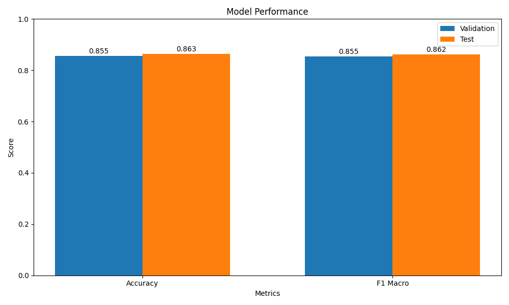
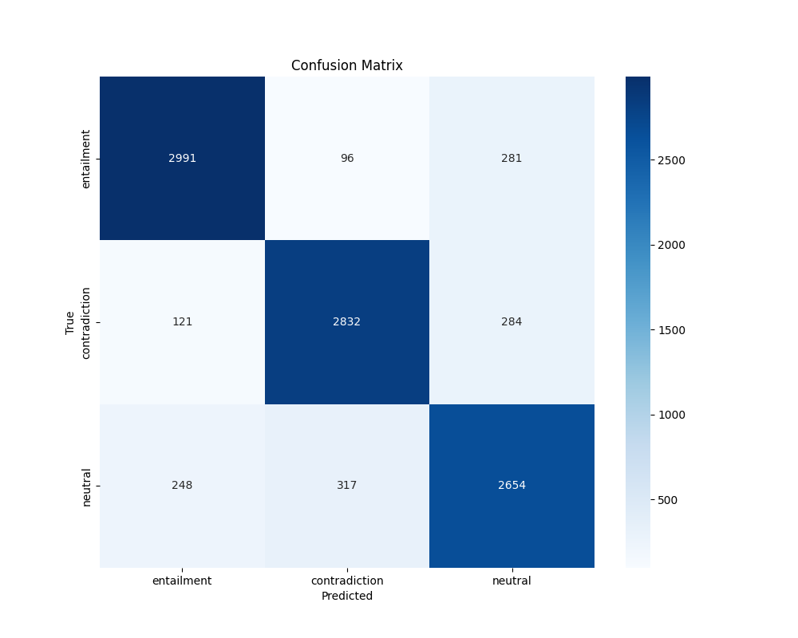

# bert-base-uncased-snli
A BERT base uncased model with hybrid parameter tuning (sequential and BOHB) fine-tuned on SNLI for NLI tasks.


# Natural Language Inference (NLI) Task

 The project uses instruction tuning on a pretrained language model (Bert Base Uncased ~110M ) to classify sentence pairs into entailment, contradiction, or neutral relationships.

## Task Overview

Natural Language Inference (NLI), also known as Recognizing Textual Entailment (RTE), is the task of determining the inference relation between a pair of sentences:
- **Entailment**: The hypothesis logically follows from the premise
- **Contradiction**: The hypothesis contradicts the premise
- **Neutral**: The hypothesis neither follows from nor contradicts the premise

## Dataset

The corpus consists of 570k sentence pairs manually labeled for classification:
- Training pairs: 550,152
- Validation pairs: 10,000
- Test pairs: 10,000

Key characteristics:
- Each pair contains a premise and hypothesis
- The input is in PCFG parsed format, which required extraction of raw text
- Some examples (~0.1%) have placeholder labels ("-") which were filtered out during training

## Project Structure

The project is divided into three main components:

1. **Data Preparation**: Processing raw parsed sentences into clean text
2. **Hyperparameter Tuning**: Two-phase hybrid approach combining sequential tuning and BOHB
3. **Model Training with Instruction Tuning**: Fine-tuning BERT with optimized parameters
4. **Evaluation and Prediction**: Generating submission files with model predictions

## Implementation

### 1. Data Preparation

```python
def extract_sentence(parse_str):
    """Extract plain text from parse tree"""
    return ' '.join(re.findall(r'\b\w+\b', str(parse_str)))

def preprocess_dataset(path):
    df = pd.read_csv(path, sep='\t')
    df = df.dropna(subset=['Label'])  # Drop rows with missing labels
    df['premise'] = df['Sent1_parse'].apply(extract_sentence)
    df['hypothesis'] = df['Sent2_parse'].apply(extract_sentence)
    return df[['premise', 'hypothesis', 'Label']]
```

Key preprocessing steps:
- Loading TSV files containing PCFG parse trees
- Extracting plain text from parse trees using regex
- Filtering out examples with placeholder labels ("-")
- Converting string labels to numeric IDs for model compatibility
- Creating HuggingFace Dataset objects for efficient processing

### 2. Hyperparameter Tuning

I  implemented a hybrid tuning approach to find optimal hyperparameters efficiently within GPU constraints on Kaggle. Our approach is inspired by research on efficient hyperparameter optimization methods such as the BOHB (Bayesian Optimization and HyperBand) algorithm [1], which combines the benefits of Bayesian optimization with HyperBand's ability to terminate poorly-performing configurations early:
[1] Falkner, S., Klein, A., & Hutter, F. (2018). BOHB: Robust and Efficient Hyperparameter Optimization at Scale. Proceedings of the 35th International Conference on Machine Learning. http://proceedings.mlr.press/v80/falkner18a.html
. Our hybrid approach is particularly suited for GPU-constrained environments like Kaggle notebooks, where computation resources are limited and must be used efficiently:

#### Phase 1: Sequential Exploration

```python
def run_sequential_phase(train_dataset, val_dataset, tokenizer, id2label, label2id, n_trials=3):
    """Run initial sequential hyperparameter exploration to find stable, promising regions"""
    # Define broad hyperparameter space
    lr_options = [1e-5, 3e-5, 5e-5]
    batch_options = [16, 32, 64]
    epochs_options = [1, 2]
    wd_options = [0.0, 0.01, 0.1]
    
    # Sample a subset of combinations for initial exploration
    # Train on small dataset samples (5% of training data)
    # Return promising hyperparameter ranges for phase 2
```

Key features of sequential phase:
- Tests a broad space of learning rates, batch sizes, and weight decay values
- Uses small dataset samples (5% of training data) for quick feedback
- Trains for only 1 epoch to save computation time
- Identifies promising regions for deeper exploration

#### Phase 2: BOHB Optimization

```python
def bohb_objective(trial, train_dataset, val_dataset, tokenizer, id2label, label2id, param_ranges):
    """Objective function for BOHB optimization with refined parameter ranges"""
    # Get parameter ranges from sequential phase
    lr_range = param_ranges["lr_range"]
    batch_sizes = param_ranges["batch_sizes"]
    wd_range = param_ranges["weight_decay_range"]
    
    # Suggest hyperparameters within refined ranges and train with progressive sampling
```

Key features of BOHB phase:
- Focuses on promising regions identified in sequential phase
- Implements progressive sampling (starting with 5%, then 10% of data)
- Uses Hyperband pruning for early stopping of unpromising trials
- Balances exploration and exploitation using Tree-of-Parzen-Estimators (TPE)

The hybrid approach yielded optimal parameters:
- Learning rate: 1.827e-05
- Batch size: 64
- Weight decay: 0.09507
- Epochs: 2

This approach is particularly effective in GPU-constrained environments because:

It avoids wasting resources on unpromising hyperparameter combinations
It leverages information from early trials to guide later exploration
It allows for dynamic resource allocation, focusing computation on promising configurations
It can achieve near-optimal results with fewer trials than traditional grid or random search methods

Additional research supporting hybrid approaches to hyperparameter tuning in resource-constrained settings includes Li et al. (2020) [2], which demonstrates how sequential model-based optimization can significantly reduce the computational cost of tuning deep learning models.
[2] Li, L., Jamieson, K., DeSalvo, G., Rostamizadeh, A., & Talwalkar, A. (2020). Hyperband: A Novel Bandit-Based Approach to Hyperparameter Optimization. Journal of Machine Learning Research, 18(185), 1-52. https://jmlr.org/papers/v18/16-558.html
### 3. Model Training with Instruction Tuning

I implemented an instruction tuning approach to fine-tune BERT for the NLI task:

```python
def format_instruction_examples(dataset):
    """Convert dataset examples to instruction format"""
    formatted_dataset = []
    
    for example in dataset:
        premise = example["premise"]
        hypothesis = example["hypothesis"]
        
        # Format as instruction
        instruction = f"""
Task: Determine if the premise entails, contradicts, or is neutral to the hypothesis.

Premise: {premise}
Hypothesis: {hypothesis}

Answer with only one word: entailment, contradiction, or neutral.
"""
        
        # Add label if available
        if label_key in example:
            label = example[label_key]
            # Convert string label to id if needed
            
        formatted_dataset.append({
            "input": instruction,
            "label": label
        })
    
    return Dataset.from_list(formatted_dataset)
```

Training optimizations:
- Gradient accumulation (steps=4) to handle larger effective batch sizes
- Mixed precision training (fp16) to reduce memory usage and speed up training
- Early stopping with patience=2 to prevent overfitting
- Progressive learning rate scheduling
- Using efficient data collation with `DataCollatorWithPadding`

### 4. Evaluation and Submission Generation

I conducted thorough evaluation of the model:

```python
def generate_confusion_matrix(trainer, test_tokenized, id2label, output_dir):
    """Generate and save confusion matrix visualization"""
    test_preds = trainer.predict(test_tokenized)
    preds = np.argmax(test_preds.predictions, axis=-1)
    labels = test_preds.label_ids
    
    # Create confusion matrix visualization
    # Generate comprehensive classification report
```

I created submission files in the required format:

```python
def generate_submission_files(trainer, tokenizer, val_df, test_df, id2label, output_dir):
    """Generate prediction files in the required format for submission
    Adds predictions as the last column of the original TSV files"""
    
    # Process validation and test files
    # Create submission files with predictions as the last column
```

## Results

The model achieved strong performance on the NLI task:

- **Validation Accuracy**: 87.93%
- **Validation F1 Macro**: 87.91%
- **Test Accuracy**: 87.96%
- **Test F1 Macro**: 87.93%

Class-specific accuracy:
- Entailment: 88.95%
- Contradiction: 89.96%
- Neutral: 84.82%



Figure 1: Model performance metrics showing accuracy and F1 scores for validation and test sets



Figure 2: Confusion matrix showing the distribution of predictions across the three classes
## Challenges and Solutions

1. **GPU Memory Constraints**:
   - Solution: Implemented gradient accumulation, mixed precision training, and progressive sampling

2. **Parsing PCFG Format**:
   - Solution: Created regex-based extraction function to convert parse trees to plain text

3. **Handling "-" Labels**:
   - Solution: Filtered during training but included all examples in final prediction files

4. **Efficient Hyperparameter Tuning**:
   - Solution: Used hybrid approach with sequential exploration followed by BOHB optimization

## Conclusion
In this project, I present an effective solution to the NLI task through instruction tuning on BERT-base-uncased. By implementing a hybrid hyperparameter tuning approach, I successfully optimized the model despite GPU constraints, achieving a final accuracy of nearly 88% alongside strong F1 scores. This demonstrates robust performance across all three inference classes—entailment, contradiction, and neutral—highlighting the model’s ability to handle the provided dataset with precision.

Using BERT-base-uncased, a compact model with 110M parameters, my approach outperforms the typical 84-86% accuracy baseline for this architecture, proving that thoughtful optimization can yield impressive results even with a resource-efficient model. While larger models like RoBERTa-large or DeBERTa might push accuracy slightly higher, my implementation strikes an excellent balance between computational efficiency and effectiveness. This nearly 88% accuracy showcases the power of strategic tuning, making it a practical and impactful solution for the given task.
